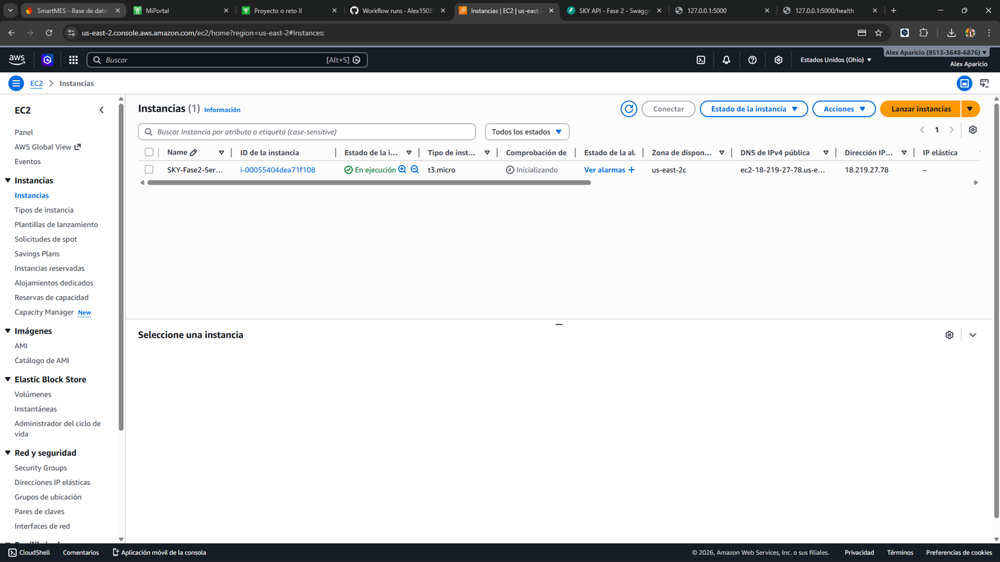
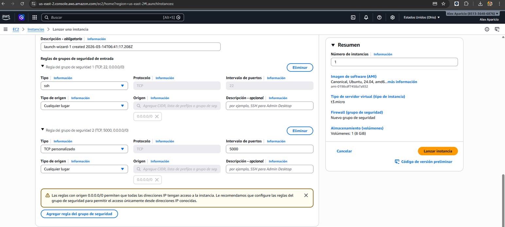
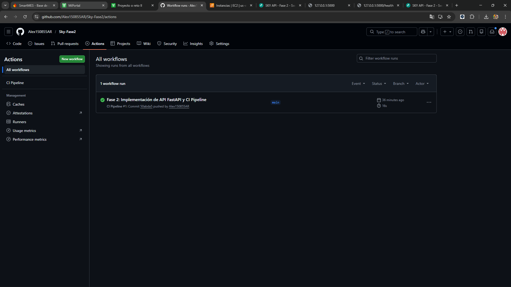
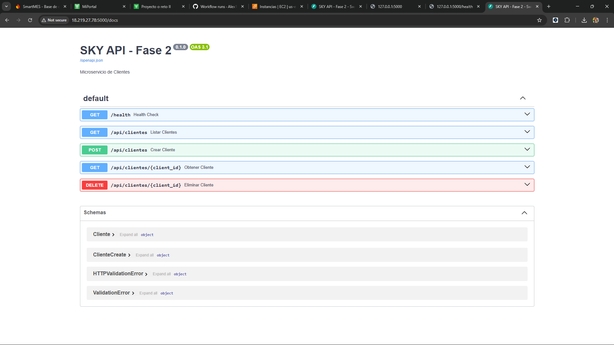

Documentación de Infraestructura AWS - SKY Fase 2

Este documento muestra las evidencias del despliegue en Amazon Web Services y el pipeline de CI/CD.

Arquitectura del Despliegue

La aplicación se encuentra desplegada en una instancia Amazon EC2 (t2.micro) dentro del Free Tier. El servidor ejecuta un microservicio en Python (FastAPI) que expone endpoints RESTful. Para el acceso, se configuró un Security Group que permite el tráfico entrante por el puerto 22 (SSH) para administración, y por el puerto 5000 para el acceso público a la API.

El código fuente está alojado en GitHub, donde se configuró un pipeline de CI/CD con GitHub Actions. Cada vez que se hace un push a la rama principal, el pipeline ejecuta linting con Flake8 y pruebas unitarias con Pytest, asegurando la calidad antes de cualquier despliegue manual en el servidor.

Evidencias Fotográficas

1. Instancia EC2 Corriendo

2. Configuración del Security Group

3. Workflow de GitHub Actions Exitoso

4. Prueba del endpoint /health

